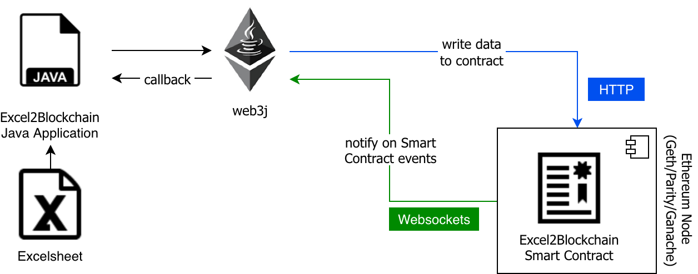

# Excel2Blockchain

In this demo data from an Excelsheet is pushed into a smart contract deployed on a Ethereum chain. The demo includes compilation and deployment of the smart contract. The chain is configured in the Java source code for simplicity, samples for Ganache/TestRPC and Rinkeby/Infura are included.

# Prerequisites

* Ganache (or any other Ethereum Node or Infura)
* Java 8+
* Maven
* optional: Git

# Setup

* Clone project with `git clone` or download the project as a compressed file

# Run

* Start Ganache with mnemonic `candy maple cake sugar pudding cream honey rich smooth crumble sweet treat`
* Import as Maven project in IDE and launch Main class   
*or*   
* Build project with `mvn clean install`
* Change to directory target and start application with `java -jar excel2blockchain-1.0-SNAPSHOT-jar-with-dependencies.jar`
